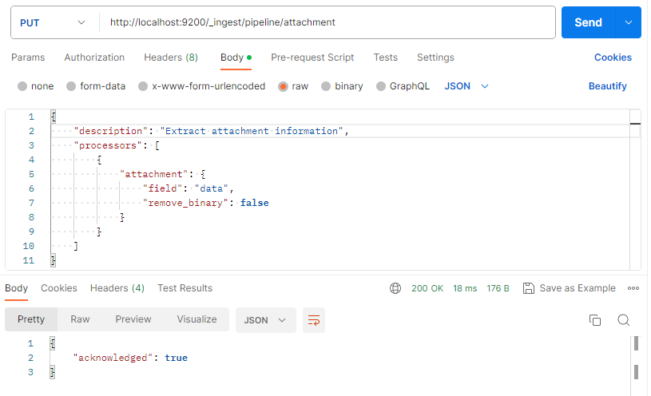

# Работа с содержимым текстовых файлов в Elasticsearch

[Elasticsearch](https://www.elastic.co/elasticsearch/) — это распределенная поисковая и аналитическая система, которая лежит в основе Elastic Stack.

Elasticsearch обеспечивает поиск и аналитику практически в реальном времени для всех типов данных. Независимо от того, структурированный или неструктурированный текст, числовые данные или геопространственные данные, Elasticsearch может эффективно хранить и индексировать их таким образом, чтобы поддерживать быстрый поиск. Позволяет выйти далеко за рамки простого поиска данных и агрегировать информацию, чтобы обнаружить тенденции и закономерности в данных.

В данной инструкции рассмотрим вопрос загрузки текстовых файлов в Elasticsearch для осуществления последующего полнотекстового поиска по содержимому загруженных файлов.

Рассмотрим следующий перечень операций:
1. Загрузка файла в Elalsticsearch.
2. Поиск файлов, содержащих нужную информацию.
3. Удаление файлов из Elalsticsearch.


Все операции доступны через API Elalsticsearch.


## Загрузка файла в Elalsticsearch

Для загрузки файла с последующим поиском по содержимому необходимо воспользоваться плагином Ingest, который в Elalsticsearch 8 версии уже имеется в базовой сборке, а для Elalsticsearch 7 нужно [установить](https://www.elastic.co/guide/en/elasticsearch/plugins/7.17/ingest-attachment.html), как отдельный плагин.

Ingest позволяет получать как мета-информацию по файлу, так и его содержимое. Может обрабатывать наиболее популярные форматы: txt, rtf, xlsx и др.

Перед загрузкой файла в Elalsticsearch, его предварительно необходимо закодировать в виде Base64-строки. Далее выполняем следующие шаги:

1. Определяем параметры для прикрепляемых файлов

```
PUT _ingest/pipeline/attachment
{
  "description" : "Extract attachment information",
  "processors" : [
    {
      "attachment" : {
        "field" : "data",
        "remove_binary": false
      }
    }
  ]
}

```

В Postman этот запрос (и результат) будет выглядеть следующим образом.




`field` – поле связываем с переменной `data`, значение которой будет передано в последующем запросе.

`remove_binary` – параметр определяющий удалить (true) или сохранить (false) двоичное представление файла в Elasticsearch.


2. Отправляем файл

- Только файл в виде Base64-строки

```
PUT my-attachment-index-01/_doc/file1_id?pipeline=attachment
{
    "data": "0K3RgtC+INGE0LDQudC7INGBINGC0LXRgdGC0L7QstGL0Lwg0YLQtdC60YHRgtC+0Lwg0LTQu9GPINC+0YLQv9GA0LDQstC60Lgg0Lgg0L/QvtC70YPRh9C10L3QuNGPLg0K0JAg0Y3RgtC+INC/0L7RgdC70LXQtNC90Y/RjyDRgdGA0L7QutCwINGE0LDQudC70LAhDQpUaGlzIGlzIGZpcnN0IHN0cmluZyBvbiBFbmdsaXNoLg0KQW5kIHRoYXQgaXMgbGFzdCBzdHJpbmcgaW4gdGhpcyBmaWxlIQ=="
}
```

- Файл и дополнительная информация (объект `file`)


```
PUT my-attachment-index-01/_doc/file1_id?pipeline=attachment
{
    "data": "0K3RgtC+INGE0LDQudC7INGBINGC0LXRgdGC0L7QstGL0Lwg0YLQtdC60YHRgtC+0Lwg0LTQu9GPINC+0YLQv9GA0LDQstC60Lgg0Lgg0L/QvtC70YPRh9C10L3QuNGPLg0K0JAg0Y3RgtC+INC/0L7RgdC70LXQtNC90Y/RjyDRgdGA0L7QutCwINGE0LDQudC70LAhDQpUaGlzIGlzIGZpcnN0IHN0cmluZyBvbiBFbmdsaXNoLg0KQW5kIHRoYXQgaXMgbGFzdCBzdHJpbmcgaW4gdGhpcyBmaWxlIQ==",
    "file": {
        "name": "file1.txt",
        "upload_key": "0000000000"
    }
}
```

`my-attachment-index-01` – уникальный индекс, который задается самостоятельно. Индекс можно рассматривать в качестве аналога таблицы с данными классических СУБД.

`file1_id` – уникальный идентификатор файла, который задается самостоятельно. Своего рода идентификатор записи в таблице.


## Поиск файлов, содержащих нужную информацию

Для поиска необходимо выполнить следующий запрос с параметрами.

```
GET my-attachment-index-01/_search
{
  "query": {
    "match": {
      "attachment.content": "для"
    }
  }       
}

```

Для ограничения получаемой информации в ответе можно указать только нужные поля.
```
GET my-attachment-index-01/_search
{
  "query": {
    "match": {
      "attachment.content": "для"
    }
  },
  "_source": "file"          
}

```


## Удаление файлов из Elalsticsearch

С помощью API Elalsticsearch доступно 2 способа удаления файлов.
1. Удаление по уникальному идентификатору.
```
DELETE /my-attachment-index-01/_doc/file1_id
```

2. По поисковому запросу.

```
POST /my-attachment-index-01/_delete_by_query
{
  "query": {
    "match": {
      "file.upload_key": "0000000000"
    }
  }      
}
```

Рекомендуется ознакомится с нюансами, которые могут возникать при удалении (см. Источники 4,5).


## Источники
1. [Attachment processor](https://www.elastic.co/guide/en/elasticsearch/reference/current/attachment.html)
2. [Match query](https://www.elastic.co/guide/en/elasticsearch/reference/current/query-dsl-match-query.html#query-dsl-match-query)
3. [Retrieve selected fields from a search](https://www.elastic.co/guide/en/elasticsearch/reference/current/search-fields.html)
4. [Delete API](https://www.elastic.co/guide/en/elasticsearch/reference/current/docs-delete.html)
5. [Delete by query API](https://www.elastic.co/guide/en/elasticsearch/reference/current/docs-delete-by-query.html)
6. [Data in: documents and indices](https://www.elastic.co/guide/en/elasticsearch/reference/current/documents-indices.html)
7. [Индексы](https://cloud.yandex.ru/docs/managed-elasticsearch/concepts/indexing)
